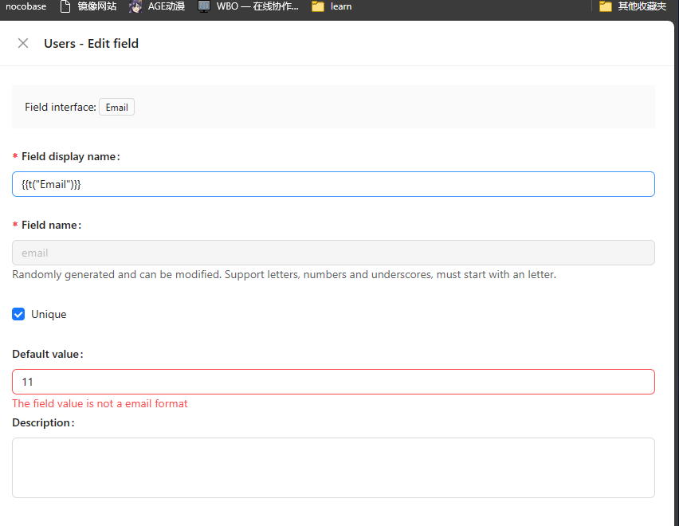

# CollectionFieldInterface

用于创建数据字段。


```ts
class CollectionFieldInterfaceV2 {
  constructor(options: CollectionFieldInterfaceOptions): {}
  name: SchemaKey;
  group: string;
  title: string;

  getOption<K extends keyof IField>(key: K): CollectionFieldInterfaceOptions[K]
  getOptions(): CollectionFieldInterfaceOptions;
  setOptions(options: CollectionFieldInterfaceOptions): void;
}
```

其需要结合 [CollectionManager](/core/collection/collection-manager#cmaddcollectionfieldinterfacesinterfaces) 使用。

```ts
const email = new CollectionFieldInterfaceV2({
  name: 'email',
  type: 'object',
  group: 'basic',
  order: 4,
  title: '{{t("Email")}}',
  sortable: true,
  default: {
    type: 'string',
    uiSchema: {
      type: 'string',
      'x-component': 'Input',
      'x-validator': 'email',
    },
  },
});

class MyPlugin extends Plugin {
  load() {
    this.app.addCollectionFieldInterfaces([ email ]);
  }
}
```

## CollectionFieldInterfaceOptions

```ts
import { ISchema } from '@formily/react';

interface CollectionFieldInterfaceOptions extends ISchema {
  name: string;
  group: string;
  order?: number;
  default?: {
    type: string;
    uiSchema?: ISchema;
    [key: string]: any;
  };
  sortable?: boolean;
  availableTypes?: string[];
  hasDefaultValue?: boolean;
  isAssociation?: boolean;
  schemaInitialize?: (schema: ISchema, data: any) => void;
  validateSchema?: (fieldSchema: ISchema) => void;
  operators?: any[];
  /**
   * - 如果该值为空，则在 Filter 组件中该字段会被过滤掉
   * - 如果该值为空，则不会在变量列表中看到该字段
   */
  filterable?: {
    /**
     * 字段所支持的操作符，会在 Filter 组件中显示，比如设置 `数据范围` 的时候可以看见
     */
    operators?: any[];
    /**
     * 为当前字段添加子选项，这个子选项会在 Filter 组件中显示，比如设置 `数据范围` 的时候可以看见
     */
    children?: any[];
    [key: string]: any;
  };
  // NOTE: set to `true` means field could be used as a title field
  titleUsable?: boolean;
  [key: string]: any;
}
```

- `default`：配置表单默认值字段 schema




TODO：类型不完整且含义不清楚，需要补充。

## 实例属性

### name

唯一标识符。

### group

分组。

### title

标题。

## 实例方法

### collectionFieldInterface.getOptions()

获取所有配置项。

```tsx | pure
import { useCollectionManagerV2 } from '@nocobase/client';

const Demo = () => {
  const collectionManager = useCollectionManagerV2();
  const options = useMemo(() => {
    const email = collectionManager.getCollectionFieldInterface('email');
    const options = email.getOptions();
  }, [collectionManager]);

  return <pre>{ JSON.stringify(options, null, 2) }</pre>
}
```

### collectionFieldInterface.setOptions(options)

设置配置项，会和原 options 深度合并。

- 类型

```tsx | pure
class CollectionFieldInterfaceV2 {
  setOptions(options: CollectionFieldInterfaceOptions): void;
}
```

- 示例

```tsx | pure
import { Plugin } from '@nocobase/client';

class MyPlugin extends Plugin {
  load() {
    const collectionManager = this.app.collectionManager.getCollectionManager();
    const email = collectionManager.getCollectionFieldInterface('email');

    // deep merge
    email.setOptions({
      properties: {
        unique: {
          type: 'boolean',
          'x-content': '{{t("Unique")}}',
          'x-decorator': 'FormItem',
          'x-component': 'Checkbox',
        }
      }
    });
  }
}
```

### collectionFieldInterface.getOption(key)

获取单个配置项。

```tsx | pure
import { useCollectionManagerV2, useCompile } from '@nocobase/client';

const Demo = () => {
  const collectionManager = useCollectionManagerV2();
  const compile = useCompile();
  const title = useMemo(() => {
    const email = collectionManager.getCollectionFieldInterface('email');
    const title = email.getOption('title');
  }, [collectionManager]);

  return <pre>{compile(title)}</pre>
}
```
