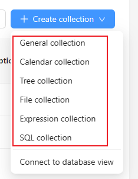

# CollectionTemplate

用于创建数据表的模板。



```ts
class CollectionTemplate {
  constructor(options: CollectionTemplateOptions) {}
  name: string;
  Collection: typeof CollectionV2;
  transform(collection: CollectionV2): void

  getOptions(): CollectionTemplateOptions
  setOptions(options: CollectionTemplateOptions): void
  getOption<K extends keyof CollectionTemplateOptions>(key: K): CollectionTemplateOptions[K]
}
```

其需要结合 [CollectionManager](/core/collection/collection-manager#cmaddcollectiontemplatestemplates) 使用。

```ts
import { Plugin, CollectionV2, CollectionTemplate } from '@nocobase/client';

class SqlCollection extends CollectionV2 {
  otherMethods() {
    // ...
  }
}

const sqlCollectionTemplate = new CollectionTemplate({
  name: 'sql',
  Collection: SqlCollection,
  title: '{{t("SQL collection")}}',
  order: 4,
  color: 'yellow',
  default: {
    fields: [],
  },
  configurableProperties: {
    title: {
      type: 'string',
      title: '{{ t("Collection display name") }}',
      required: true,
      'x-decorator': 'FormItem',
      'x-component': 'Input',
    },
    // ...
  },
});

class MyPlugin extends Plugin {
  async load() {
    this.app.collectionManager.addCollectionTemplates([ sqlCollectionTemplate ]);
  }
}
```

## CollectionTemplateOptions

```ts
 interface CollectionTemplateOptions {
  name: string;
  Collection?: typeof CollectionV2;
  title?: string;
  color?: string;
  order?: number;
  default?: CollectionOptions;
  events?: any;
  configurableProperties?: Record<string, ISchema>;
  availableFieldInterfaces?: AvailableFieldInterfacesInclude | AvailableFieldInterfacesExclude;
  divider?: boolean;
  description?: string;
  configureActions?: Record<string, ISchema>;
  forbidDeletion?: boolean;
}
```

- `name`：唯一标识符，用于标识模板。
- `Collection`：模板对应的数据表类。

在创建数据表后，Collection 会有 [template 字段](/core/collection/collection#collectionoptions)，用于标识该数据表是由哪个模板创建的。

当通过 `collectionManager.addCollections()` 添加数据表对象时，会先读取 `collection.template` 字段，然后通过 `collectionManager.getCollectionTemplate(collection.template)` 获取到 `collectionTemplate`。

读取 `collectionTemplate.Collection` 字段，并通过 `new collectionTemplate.Collection(collection)` 创建对应的实例。

如果不传递 `Collection`，则会通过 `new CollectionV2(collection)` 创建对应的实例。

```ts
class SqlCollection extends CollectionV2 {
  otherMethods() {
    // ...
  }
}

const sqlCollectionTemplate = new CollectionTemplate({
  name: 'sql',
  Collection: SqlCollection,
  // ...
});
```

- `title`：模板的标题
- `color`：模板的颜色？
- `order`：模板的排序
- `events`：事件
  - `beforeSubmit`：提交前触发
- `configurableProperties`：表单配置项


```ts
const sqlCollectionTemplate = new CollectionTemplate({
  name: 'sql',
  // ...
  configurableProperties: {
    title: {
      type: 'string',
      title: '{{ t("Collection display name") }}',
      required: true,
      'x-decorator': 'FormItem',
      'x-component': 'Input',
    },
    name: {
      type: 'string',
      title: '{{t("Collection name")}}',
      required: true,
      'x-disabled': '{{ !createOnly }}',
      'x-decorator': 'FormItem',
      'x-component': 'Input',
      'x-validator': 'uid',
      description:
        "{{t('Randomly generated and can be modified. Support letters, numbers and underscores, must start with an letter.')}}",
    },
    // ...
  },
});
```

- `default`：表单默认值

## 实例属性

### collectionTemplate.name

唯一标识符。

### collectionTemplate.Collection

模板对应的数据表类。

## 实例方法

### collectionTemplate.transform(collection)

collection 创建后，会调用该方法，用于对 collection 进行转换。

### collectionTemplate.getOptions()

获取所有配置项。

```tsx | pure
import { useCollectionManagerV2 } from '@nocobase/client';

const Demo = () => {
  const collectionManager = useCollectionManagerV2();
  const options = useMemo(() => {
    const sqlCollectionTemplate = collectionManager.getCollectionTemplate('sql');
    const options = sqlCollectionTemplate.getOptions();
  }, [collectionManager]);

  return <pre>{ JSON.stringify(options, null, 2) }</pre>
}
```

### collectionTemplate.setOptions(options)

设置配置项，会和原 options 深度合并。

```tsx | pure
import { Plugin } from '@nocobase/client';

class MyPlugin extends Plugin {
  load() {
    const collectionManager = this.app.collectionManager.getCollectionManager();
    const sqlCollectionTemplate = collectionManager.getCollectionTemplate('sql');

    // deep merge
    sqlCollectionTemplate.setOptions({
      configurableProperties: {
        title: {
          type: 'string',
          title: '{{ t("Collection display name") }}',
          required: true,
          'x-decorator': 'FormItem',
          'x-component': 'Input',
        }
      },
    });
  }
}
```

### collectionTemplate.getOption(key)

获取单个配置项。

```tsx | pure
import { useCollectionManagerV2, useCompile } from '@nocobase/client';

const Demo = () => {
  const collectionManager = useCollectionManagerV2();
  const compile = useCompile();
  const title = useMemo(() => {
    const sqlCollectionTemplate = collectionManager.getCollectionTemplate('sql');
    const title = sqlCollectionTemplate.getOption('title');
  }, [collectionManager]);

  return <pre>{compile(title)}</pre>
}
```

## Utils

### getConfigurableProperties()

用于获取内置的配置项字段。

- 类型

```tsx | pure
export type DefaultConfigurableKeys =
  | 'name'
  | 'title'
  | 'inherits'
  | 'category'
  | 'autoGenId'
  | 'createdBy'
  | 'updatedBy'
  | 'createdAt'
  | 'updatedAt'
  | 'sortable'
  | 'description'
  | 'moreOptions';

const getConfigurableProperties: (...keys: DefaultConfigurableKeys[]) => Record<DefaultConfigurableKeys, any>
```

- 示例

```tsx | pure
import { getConfigurableProperties } from '@nocobase/client';

const sqlCollectionTemplate = new CollectionTemplate({
  name: 'sql',
  // ...
  configurableProperties: {
    ...getConfigurableProperties('name', 'title', 'description'),
    // ...
  },
});
```
